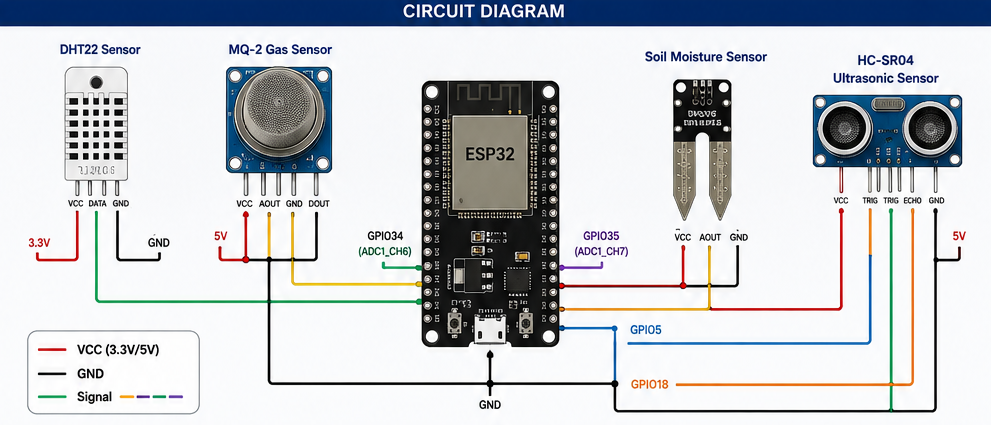
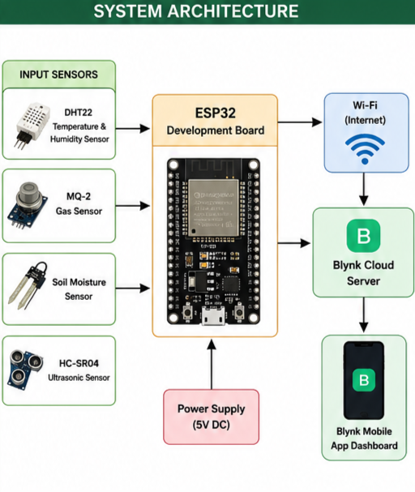
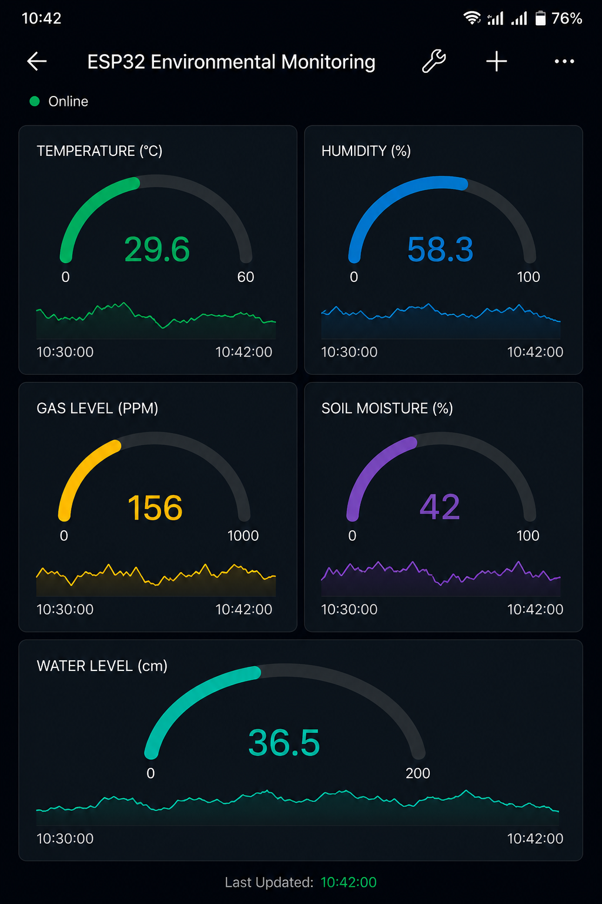

# ESP32-Based IoT Environmental Monitoring System

A multi-sensor IoT monitoring system using ESP32 with real-time cloud dashboard,
threshold-based gas alerting, and human-readable sensor output via Blynk.

> **Status:** Completed and tested on physical hardware

---

## The Problem It Solves

Raw sensor data is useless without context. A gas sensor returning `2048` tells
you nothing — is that dangerous? This system adds threshold logic, percentage
conversion, and sensor fault detection so the data is actually actionable:

- Gas levels converted to percentage with configurable alert threshold
- Soil moisture mapped from raw ADC to 0–100% with dry-soil warning
- DHT22 NaN guard prevents silent data corruption on sensor failure
- HC-SR04 timeout prevents CPU hang on missing echo
- MQ2 30-second warmup enforced on boot for valid readings

---

## Circuit Diagram



---

## System Architecture



---

## Technical Highlights

- **Sensor fault detection** — DHT22 reads are validated with `isnan()` before
  transmission. Failed reads are logged and skipped, not silently sent as garbage
- **ADC to human units** — Raw 12-bit ADC values (0–4095) converted to percentages
  using `map()` + `constrain()` for both gas and soil sensors
- **Gas threshold alerting** — Configurable `GAS_THRESHOLD` constant triggers a
  Blynk LED widget alert when exceeded. Resets automatically when safe
- **HC-SR04 timeout guard** — `pulseIn()` called with 25ms timeout. Returns -1
  on no-echo instead of hanging the CPU indefinitely
- **MQ2 warmup enforcement** — 30-second boot delay with countdown on Serial
  prevents invalid cold-start readings from reaching the dashboard
- **Named virtual pins** — `#define VPIN_TEMP V0` pattern makes Blynk mappings
  readable and easy to reconfigure

---

## Blynk Dashboard Setup

|Virtual|     Widget    |  Label            |
|  Pin  |               |                   |
|-------|---------------|-------------------|
| V0    | Gauge / Value | Temperature (°C)  |
| V1    | Gauge / Value | Humidity (%)      |
| V2    | Gauge / Value | Gas Level (%)     |
| V3    | Gauge / Value | Soil Moisture (%) |
| V4    | Value Display | Distance (cm)     |
| V5    | LED Widget    | Gas Alert         |



---

## Hardware

Full bill of materials and pin map: [`hardware/components.md`](hardware/components.md)

|     Component        |           Role                 |
|----------------------|--------------------------------|
| ESP32 Dev Board      | Microcontroller + Wi-Fi        |
| DHT22                | Temperature & Humidity         |
| MQ-2 Gas Sensor      | Gas leak detection (LPG, smoke)|
| Soil Moisture Sensor | Soil wetness percentage        |
| HC-SR04 Ultrasonic   | Water level / distance         |

---

## Setup Instructions

1. Wire components per [`hardware/components.md`](hardware/components.md)
2. Install libraries via Arduino Library Manager:
   - `Blynk` by Volodymyr Shymanskyy
   - `DHT sensor library` by Adafruit
   - `WiFi` (built-in with ESP32 board package)
3. Replace credentials in `EnvMonitor.ino`:
```cpp
   #define BLYNK_TEMPLATE_ID   "your_template_id"
   #define BLYNK_AUTH_TOKEN    "your_auth_token"
   char ssid[] = "your_wifi_name";
   char pass[] = "your_wifi_password";
```
4. Open `EnvMonitor/EnvMonitor.ino` → select **Board:** ESP32 Dev Module → Upload
5. Open Serial Monitor at 115200 baud to watch sensor readings and warmup countdown

---

## Challenges & Design Decisions

**Why convert ADC to percentage instead of sending raw values?**
Raw ADC (0–4095) is meaningless on a dashboard. A recruiter or user seeing "2048"
for soil moisture doesn't know if that's wet or dry. Percentage conversion makes
readings immediately interpretable without a datasheet.

**Why guard DHT22 reads with `isnan()`?**
DHT22 returns `NaN` on communication failure. Sending `NaN` to Blynk corrupts the
gauge widget display silently. The guard logs the failure and skips transmission
instead of polluting the dashboard.

**Why enforce a 30-second MQ2 warmup?**
The MQ-2 heater element needs time to stabilize. Cold readings are unreliable and
will trigger false gas alerts. The warmup countdown is visible in Serial Monitor
so the user knows the system isn't frozen.

**Why add a timeout to `pulseIn()`?**
Without a timeout, if HC-SR04 gets no echo (out of range, sensor disconnected),
`pulseIn()` blocks indefinitely — freezing the entire system. A 25ms timeout
returns -1 gracefully and logs the failure.

---

## Author

**Jerush Thanusha T**
B.E. Electronics and Communication Engineering
Government College of Engineering, Tirunelveli

[LinkedIn](#) · [GitHub](https://github.com/Jerush16)
